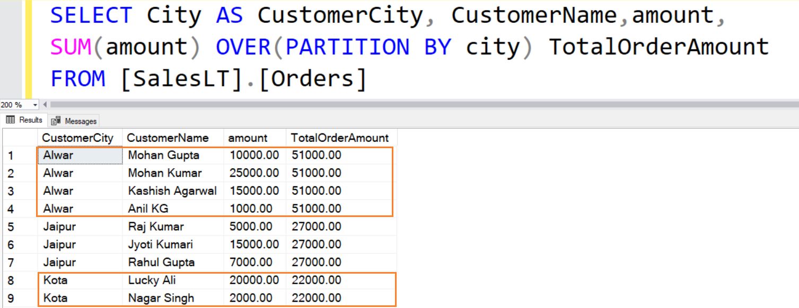

# Analytical Functions and Common Table Expressions

## Module Introduction

This module explores advanced SQL features for analytical reporting: **window functions** and **common table expressions (CTEs)**. Using the STUDENT schema, you will learn to rank, compare, and partition rows in ways that go beyond the capabilities of traditional aggregate functions.

## Explanation

### The OVER Clause

In SQL, an `OVER` clause is similar to our concept of a group from earlier. It is a way of selecting some collection of rows, over which you will calculate some value.

The main difference between the `OVER` AND `GROUP BY` clause is that an `OVER` clause *calculates a value for every input row*. We can essentially calculate groups or windows, and then broadcast the values *back out* to our original data structure.

Consider the visual below. In this case, the total order amount is similar to the result of a `GROUP BY` aggregation. However, instead of calculating this value and joining it back to our original table, we can do the entire process by using an `OVER` clause.



### PARTITION BY, and ROWS BETWEEN

The `PARTITION BY` clause divides the result set into groups to which the window function is applied. `ROWS BETWEEN` defines the frame within each partition.

Example: 3-row moving average of `numeric_grade`:

```sql
SELECT student_id, section_id, numeric_grade,
       ROUND(AVG(numeric_grade) OVER (
         PARTITION BY section_id
         ORDER BY numeric_grade
         ROWS BETWEEN 1 PRECEDING AND 1 FOLLOWING
       ), 1) AS moving_avg
FROM grade;
```

This query calculates a moving average that includes the current row plus one row before and after, partitioned by section.

**Reference**: Lab 17.1

### Window Functions: RANK, LAG, LEAD

Window functions compute results across a "window" of rows related to the current row, without collapsing the result set.

**`RANK`** assigns the same rank to tied rows and leaves gaps in ranking:

```sql
SELECT student_id, section_id, numeric_grade,
       RANK() OVER (PARTITION BY section_id ORDER BY numeric_grade DESC) AS rank_in_section
FROM grade;
```

This query ranks students by their numeric grade within each section, with the highest grades receiving rank 1.

**`LAG`** returns the value of a column from a previous row:

```sql
SELECT student_id, section_id, numeric_grade,
       LAG(numeric_grade) OVER (PARTITION BY section_id ORDER BY numeric_grade) AS previous_grade
FROM grade;
```

This query shows each grade along with the previous (lower) grade within the same section.

**`LEAD`** retrieves the value from a subsequent row:

```sql
SELECT student_id, section_id, numeric_grade,
       LEAD(numeric_grade) OVER (PARTITION BY section_id ORDER BY numeric_grade) AS next_grade
FROM grade;
```

This query shows each grade along with the next (higher) grade within the same section.

**Reference**: Lab 17.1

### Common Table Expressions (CTEs)

CTEs allow you to define temporary result sets for use within a larger query, often improving readability.

```sql
WITH high_scores AS (
  SELECT student_id, section_id, numeric_grade
  FROM grade
  WHERE numeric_grade >= 90
)
SELECT hs.student_id, s.last_name, hs.numeric_grade
FROM high_scores hs
JOIN student s ON hs.student_id = s.student_id;
```

This query first identifies high-scoring grades, then joins with student information for a readable result.

You can also chain multiple CTEs:

```sql
WITH base AS (
  SELECT * FROM enrollment
),
grouped AS (
  SELECT section_id, COUNT(*) AS total_enrollments
  FROM base
  GROUP BY section_id
)
SELECT * FROM grouped WHERE total_enrollments > 5;
```

This query demonstrates chaining CTEs to break down complex logic into manageable steps.

> N.B. We highly encourage using CTEs whenever you need to write queries with more than a couple of steps.
> - Treat each CTE as a self-contained transformation of your data.
> - This makes debugging much easier; you will have created several checkpoints for yourself, which makes it easier for you to check your logic.
> - See the chapter on refactoring queries with CTEs for more advice on this topic.

**Reference**: Lab 17.1

## Exercises

1. **Rank students by grade**
   List `student_id`, `section_id`, and `numeric_grade` from the `GRADE` table with a rank by section (use `RANK`).

2. **Find previous grade**
   Use the `GRADE` table and `LAG` to show the prior student's grade (ordered by grade) for each section.

3. **Find next grade**
   Use the `GRADE` table and `LEAD` to display the next student's grade for each section.

4. **Moving average by section**
   Show `student_id`, `numeric_grade`, and the moving average of grade within the same section from the `GRADE` table using `ROWS BETWEEN`.

5. **CTE for students with perfect grades**
   Use a `WITH` clause on the `GRADE` table to find students who earned a grade of 100. Then join with `STUDENT`, `ENROLLMENT`, `SECTION`, and `COURSE` tables to display their full name and course description.

6. **Chained CTEs for average grades**
   First, define a CTE using the `GRADE` table for average grade by section rounded to two places. Then, in the main query, filter for averages above 85 and join with `SECTION` and `COURSE` tables.

## Q&A

Use the following questions to guide class discussion or individual reflection after completing the exercises:

1. When would you use `RANK` instead of `ROW_NUMBER`, and what difference does it make for tied values?
2. Can you think of a real-world example where `LAG` or `LEAD` would be critical for analysis?
3. How does using `PARTITION BY` affect the behavior of window functions compared to not using it?
4. Why might someone choose to use `ROWS BETWEEN` instead of a simpler `AVG()` grouped by section?
5. What are some advantages of using CTEs (`WITH` clauses) instead of subqueries?
6. How could chained CTEs improve the readability of a multi-step analytical query?
7. What are the limitations of window functions? Are there any operations they cannot perform that require joins or subqueries instead?

## Answers

**1.**

```sql
SELECT student_id, section_id, numeric_grade,
       RANK() OVER (PARTITION BY section_id ORDER BY numeric_grade DESC) AS rank_in_section
FROM grade;
```

**2.**

```sql
SELECT student_id, section_id, numeric_grade,
       LAG(numeric_grade) OVER (PARTITION BY section_id ORDER BY numeric_grade) AS previous_grade
FROM grade;
```

**3.**

```sql
SELECT student_id, section_id, numeric_grade,
       LEAD(numeric_grade) OVER (PARTITION BY section_id ORDER BY numeric_grade) AS next_grade
FROM grade;
```

**4.**

```sql
SELECT student_id, section_id, numeric_grade,
       ROUND(AVG(numeric_grade) OVER (
         PARTITION BY section_id
         ORDER BY numeric_grade
         ROWS BETWEEN 1 PRECEDING AND 1 FOLLOWING
       ), 1) AS moving_avg
FROM grade;
```

**5.**

```sql
WITH perfect_scores AS (
  SELECT student_id, section_id FROM grade WHERE numeric_grade = 100
)
SELECT s.first_name, s.last_name, c.description
FROM perfect_scores ps
JOIN student s ON ps.student_id = s.student_id
JOIN enrollment e ON s.student_id = e.student_id AND ps.section_id = e.section_id
JOIN section sec ON e.section_id = sec.section_id
JOIN course c ON sec.course_no = c.course_no;
```

**6.**

```sql
WITH avg_grades AS (
  SELECT section_id, ROUND(AVG(numeric_grade), 2) AS avg_grade
  FROM grade
  GROUP BY section_id
),
filtered AS (
  SELECT * FROM avg_grades WHERE avg_grade > 85
)
SELECT f.section_id, f.avg_grade, c.description
FROM filtered f
JOIN section s ON f.section_id = s.section_id
JOIN course c ON s.course_no = c.course_no;
```