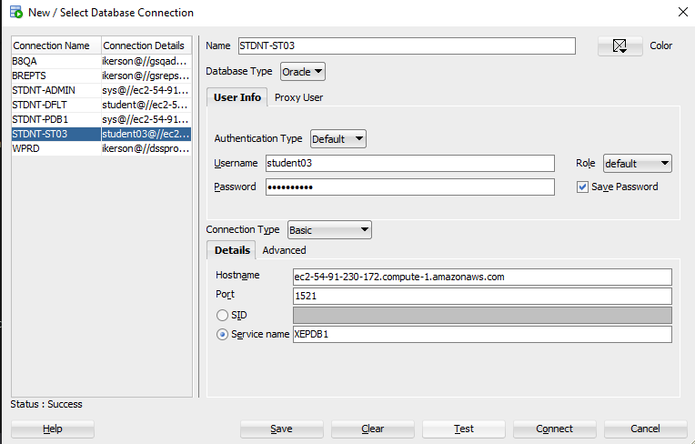
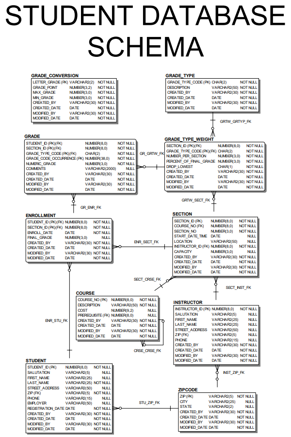

# Course Setup

## Install SQL Developer

To begin, you must install Oracle SQL Developer:

1. Download the latest version from the official Oracle site:
   [SQL Developer Downloads](https://www.oracle.com/tools/downloads/sqldev-downloads.html)

   - If you are at GSU, you should download SQL Developer from the Software Center.
   - For those who are not familiar with it, the Software Center is a GSU-specific application management tool for installing software on GSU-managed machines. See IIT for clarifications if you need further details.

2. Follow installation instructions for your operating system.

3. Launch SQL Developer once installation is complete.

## Connect to the Oracle Database

Use the following steps to connect to the course Oracle database instance:

1. Open **SQL Developer**

2. Go to **Tools** → **Connections**

3. Click **New Connection** or the **+** icon

4. Enter the following connection information:
   - Instead of `studentXX` or `STDNT-STXX`, you should use the numbered student account provided to you, such as `student07`. Consult with the course intructors if you need additional clarifications.

   | Field        | Value                                       |
   | ------------ | ------------------------------------------- |
   | Name         | `STDNT-STXX` (or any descriptive name)      |
   | Username     | `studentXX`                                 |
   | Password     | *your password* (check "Save Password")     |
   | Role         | `default`                                   |
   | Hostname     | `ec2-54-91-230-172.compute-1.amazonaws.com` |
   | Port         | `1521`                                      |
   | Service Name | `XEPDB1`                                    |

5. Click **Test** to verify the connection (should return “Success”)

6. Click **Save** to store the connection



## View the STUDENT Schema Tables

Once connected, you can explore the schema using the GUI or SQL query.

### View Tables with Comments (recommended query)

```sql
SELECT * 
FROM all_col_comments 
WHERE owner = 'STUDENT' 
  AND table_name NOT LIKE 'BIN%';
```

This will return all tables and column-level documentation available in the STUDENT schema.

> Tables beginning with the word `BIN` reference recently deleted items. We have written the query above to exclude them from your results.

For more details, consult Labs 1.3 and 2.1 in *Oracle SQL by Example (4th Edition)*.

## STUDENT Schema Outline

The STUDENT schema includes the following core tables:

* **STUDENT**: Stores personal and contact information for each student.
* **COURSE**: Lists available courses including descriptions and prerequisites.
* **SECTION**: Represents specific course sections offered at particular times and locations.
* **ENROLLMENT**: Records which students are enrolled in which sections, including final grades.
* **INSTRUCTOR**: Contains contact and profile information for instructors.
* **GRADE**: Records student grades for individual assignments or exams.
* **GRADE\_TYPE**: Defines grade categories such as homework or midterm.
* **GRADE\_TYPE\_WEIGHT**: Specifies how grade types contribute to final grades for a section.
* **GRADE\_CONVERSION**: Maps numeric grades to letter grades and grade points.
* **ZIPCODE**: Maps ZIP codes to city and state names for address normalization.

This schema is used throughout the course to support querying, aggregating, and manipulating real-world academic data.

Refer to **Appendix D** of *Oracle SQL by Example (4th Edition)* for a detailed schema diagram or download a PDF version of the schema diagram here: [STUDENT Database Schema PDF](assests/STUDENT_SCHEMA.pdf).

