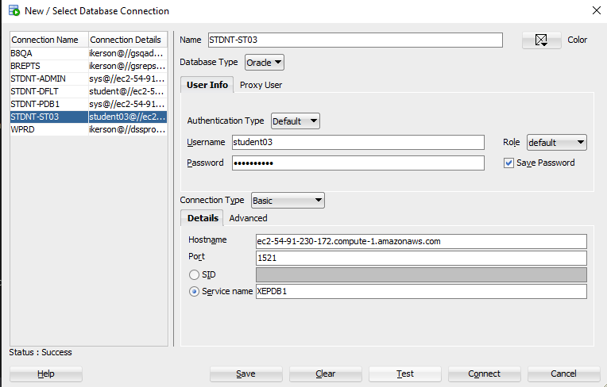

# Course Setup {#sec-setup}

## Install SQL Developer

To begin, you must install Oracle SQL Developer:

1. Download the latest version from the official Oracle site:
   [SQL Developer Downloads](https://www.oracle.com/tools/downloads/sqldev-downloads.html)

   - If you are at GSU, you should download SQL Developer from the Software Center.
   - For those who are not familiar with it, the Software Center is a GSU-specific application management tool for installing software on GSU-managed machines. See IIT for clarifications if you need further details.

2. Follow installation instructions for your operating system.

3. Launch SQL Developer once installation is complete.

## Connect to the Oracle Database

:::{.callout-tip}
Once connected, you can start familiarizing yourself with the database's structure! Take a look at [the Student Database Schema](Student_Database_Schema.md) for an overview of the key data elements and where to find them.
:::

Use the following steps to connect to the course Oracle database instance:

1. Open **SQL Developer**

2. Go to **Tools** → **Connections**

3. Click **New Connection** or the **+** icon

4. Enter the following connection information:
   - Instead of `studentXX` or `STDNT-STXX`, you should use the numbered student account provided to you, such as `student07`. Consult with the course intructors if you need additional clarifications.

   | Field        | Value                                       |
   | ------------ | ------------------------------------------- |
   | Name         | `STDNT-STXX` (or any descriptive name)      |
   | Username     | `studentXX`                                 |
   | Password     | *your password* (check "Save Password")     |
   | Role         | `default`                                   |
   | Hostname     | `ec2-54-91-230-172.compute-1.amazonaws.com` |
   | Port         | `1521`                                      |
   | Service Name | `XEPDB1`                                    |

5. Click **Test** to verify the connection (should return “Success”)

6. Click **Save** to store the connection

