# Database Schemas and Organization

## Module Introduction

So far, you've been writing queries against tables that already exist. Before you go further, it's worth stepping back and asking two foundational questions:

1. Where do tables actually "live" inside an Oracle database?
2. Why are the tables you've been querying broken up into so many small, related pieces instead of just a few wide tables?

The first question is about **schemas**, which are how relational database management systems, like Oracle, organize and own database objects. The second question is about **normalization**, the design process that determines how data gets split across tables in the first place. Understanding both will make the rest of your SQL work feel much more intuitive, because you'll understand *why* the data is shaped the way it is.

:::{.callout-note}
This module is more conceptual than syntax-heavy. There isn't much new SQL here; instead, the goal is to give you a mental model for how Oracle databases are organized and why relational design looks the way it does.
:::

**Reference**: Oracle Database documentation, [*Schemas and Schema Objects*](https://docs.oracle.com/en/database/oracle/oracle-database/26/dbiad/db_schemas.html)

## Explanation

### Database Schemata

#### What Is a Schema in Oracle?

](img/schema_in_oracle.png)

In everyday conversation, people often use "schema" loosely to mean "the structure of a database," i.e. the tables, columns, and relationships. Oracle uses the term more specifically.

In Oracle, a **schema** is a logical container that holds a related set of objects, namely:

- Tables
- Indexes
- Views
- Other entities, like custom functions

Every Oracle database user account owns exactly one schema, and that schema shares the user's name.

> For example, if you're logged in as `HR`, you're also working inside the `HR` schema. When you create a table without specifying an owner, it's created in your own schema.

:::{.callout-important}
This is a bit different from some other database systems, where a "schema" is just a namespace you can create and populate independently of any particular user. In Oracle, the schema and the user account are tightly linked — each user is guaranteed to have their own schema.

Why? The real reason is historical. It's a design-quirk, but if you're using Oracle, it's unavoidable.
:::

A few practical consequences follow from this:

- When you reference a table owned by someone else, you often need to qualify it with the owner's name, like `HR.EMPLOYEES`.
- Two different schemas can each have their own table named `EMPLOYEES` without conflict, because the schema name disambiguates them.
- Not *everything* in an Oracle database lives inside a schema. Things like user accounts themselves, roles, and certain dictionary objects exist at the database level, outside of any single schema.

#### Schema Objects

A schema can contain several kinds of objects. Some important ones include:

- **Tables** store your actual data in rows and columns. They are the core building block of a relational database, and the object type you've spent the most time working with.
- **Views** are stored queries. A view doesn't hold its own copy of data — it presents a customized, reusable way of looking at data from one or more tables. If you find yourself writing the same complex query repeatedly, a view may be a good candidate to simplify things.
- **Synonyms** are aliases for other schema objects, often used to simplify or shorten references to objects owned by another schema.

### Multi-Relation Databases

#### Why Have Many Tables?

Now for the second half of this module: why does a typical schema contain so many narrow, related tables instead of a few wide ones?

Imagine you're tracking student course enrollments, and you decide to keep everything in a single table:

|STUDENT_ID|FIRST_NAME|LAST_NAME|SECTION_ID|DESCRIPTION|ENROLL_DATE|
|----------|----------|---------|----------|-----------|-----------|
|102|Fred|Crocitto|86|Intro to Programming|30-JAN-07|
|102|Fred|Crocitto|89|Intro to Programming|30-JAN-07|
|103|J.|Landry|81|Intro to Information Systems|30-JAN-07|
|104|Laetia|Enison|81|Intro to Information Systems|30-JAN-07|


This looks convenient at first — everything you need is right there in one place. But it creates several problems as soon as the data needs to change:

- **Update anomalies.** If `J. Smith` gets married and changes their name, you have to find and update *every row* where they appear as an instructor. Miss one, and your data is now inconsistent — the same real-world instructor now has two different names on file.
- **Insertion anomalies.** What if you want to add a new course to the catalog, but no students have enrolled in it yet? In this table structure, you can't represent that course at all, because every row requires a `student_id`.
- **Deletion anomalies.** If `B. Lopez` drops their only course, deleting that row also deletes all information about the `Intro to Java` course itself — an unrelated piece of information gets destroyed as a side effect.
- **Redundancy and wasted storage.** Notice that `Intro to Programming` and `Fred Crocitto` are repeated on multiple rows. At small scale, this is just wasteful. At large scale, this repetition also increases the chance of the data becoming inconsistent (e.g., "Intro to Java" spelled differently on two rows).

#### Organizing Data in Many Tables

**Normalization** is the process of organizing tables to minimize this redundancy and avoid these anomalies. In practice, this means splitting a single wide table into several smaller, focused tables which relate to each other. For example, you might have a table for:

- Students
- Courses
- Instructors
- Tracking *which* students are enrolled in *which* courses

Each table describes exactly one kind of "thing," and relationships between things are represented with keys rather than by repeating data.

::: {.callout-note collapse="true"}
## Optional: A Quick Normalization Example (Using Our Course Schema)

Imagine `ENROLLMENT` wasn't normalized, and instead every enrollment record carried *all* of this in one row:

|STUDENT_ID|FIRST_NAME|LAST_NAME|SECTION_ID|DESCRIPTION|ENROLL_DATE|
|----------|----------|---------|----------|-----------|-----------|
|102|Fred|Crocitto|86|Intro to Programming|30-JAN-07|
|102|Fred|Crocitto|89|Intro to Programming|30-JAN-07|
|103|J.|Landry|81|Intro to Information Systems|30-JAN-07|
|104|Laetia|Enison|81|Intro to Information Systems|30-JAN-07|


Notice the following elements are repeated:

- `STUDENT_ID`
- `FIRST_NAME`
- `LAST_NAME`
- `DESCRIPTION`

This is redundant. Additionally, if `J. LANDRY`'s name changes, or the course description is corrected, you'd have to update it in every matching row.

This is exactly why the course schema splits this into separate tables instead:



Each fact is now stored exactly once. To get back to the "everything in one row" view you started with, you `JOIN` these four tables together — which is exactly what you'll be doing in the next module.

If you wanted to get the representation we originally had, you can use join logic like the following (see the chapters on [joins](Basic_Joins.md) for more details):

```sql
SELECT
    s.student_id,
    s.FIRST_NAME,
    s.LAST_NAME,
    e.SECTION_ID,
    c.DESCRIPTION,
    e.ENROLL_DATE
FROM
    STUDENT s
    JOIN ENROLLMENT e ON s.student_id = e.student_id
    JOIN SECTION sec ON e.SECTION_ID = sec.SECTION_ID
    JOIN course c ON c.course_no = sec.course_no
ORDER BY s.student_ID
FETCH FIRST 4 ROWS ONLY;
```
:::

:::{.callout-note}
#### Normalization vs. Denormalization
A fully normalized schema minimizes redundancy and keeps data consistent, but it also means that answering a question often requires **joining** several tables back together, since related pieces of information are no longer stored in the same row.

- This is exactly why joins are such a central part of SQL, and why we'll spend real time on them in the modules ahead.
    - Every join you write is essentially reassembling information that normalization intentionally spread across multiple tables.
- For some systems, particularly reporting and analytics tools that prioritize read speed over storage efficiency, designers deliberately introduce some redundancy back into the schema.
    - This is called **denormalization**, and it trades some of normalization's consistency guarantees for faster, simpler queries.
    - Ideally, these denormalized structures should be **views**. As an analyst, it typically doesn't matter to you whether the table is a view or a real table; you can write the same queries against the source either way.
:::

## Q&A

Some food for thought:

- If normalization reduces redundancy and prevents anomalies, why wouldn't every database always be fully normalized?
- Two schemas can each contain a table called `EMPLOYEES`. How would you write a query that makes clear which one you mean?
- Where do views fit into this picture — are they normalized data, or something else entirely?

## Additional Resources

For more details, see the resources below.

### Further Reading

- Oracle Database documentation, [*Schemas and Schema Objects*](https://docs.oracle.com/en/database/oracle/oracle-database/26/dbiad/db_schemas.html)
- Oracle SQL by Example ([Rischert 2009](references.html#ref-rischert09)) — early chapters cover the relational model and table design in more depth.
