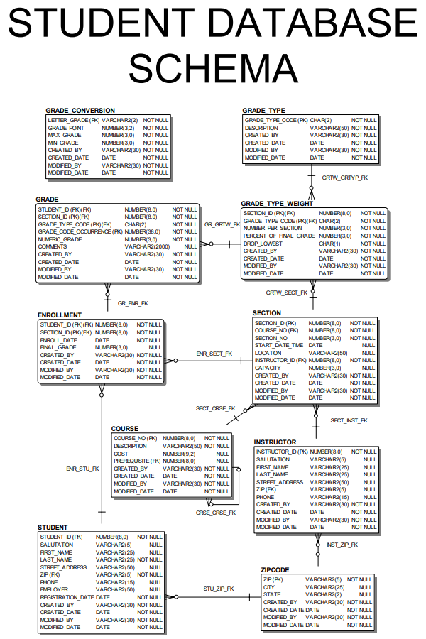

# The Student Database Schema {.unnumbered}

:::{.callout-tip}
You'll need to connect to the database before this section is useful to you! Follow the instructions in @sec-setup to get connected.
:::

## View the STUDENT Schema Tables

Once connected, you can explore the schema using the GUI or SQL query.


```sql
-- View Tables with Comments (recommended query)
SELECT * 
FROM all_col_comments 
WHERE owner = 'STUDENT' 
  AND table_name NOT LIKE 'BIN%';
```


This will return all tables and column-level documentation available in the STUDENT schema.

> Tables beginning with the word `BIN` reference recently deleted items. We have written the query above to exclude them from your results.

For more details, consult Labs 1.3 and 2.1 in *Oracle SQL by Example (4th Edition)*.

## Database Map

Refer to **Appendix D** of *Oracle SQL by Example (4th Edition)* for a detailed schema diagram or download a PDF version of the schema diagram here: [STUDENT Database Schema PDF](assests/STUDENT_SCHEMA.pdf).



## Data Dictionary

This schema is used throughout the course to support querying, aggregating, and manipulating real-world academic data.

The STUDENT schema includes the following core tables:

|Table Name| Description|
|----------|------------|
|**STUDENT**|Stores personal and contact information for each student.|
|**COURSE**|Lists available courses including descriptions and prerequisites.|
|**SECTION**|Represents specific course sections offered at particular times and locations.|
|**ENROLLMENT**|Records which students are enrolled in which sections, including final grades.|
|**INSTRUCTOR**|Contains contact and profile information for instructors.|
|**GRADE**|Records student grades for individual assignments or exams.|
|**GRADE\_TYPE**|Defines grade categories such as homework or midterm.|
|**GRADE\_TYPE\_WEIGHT**|Specifies how grade types contribute to final grades for a section.|
|**GRADE\_CONVERSION**|Maps numeric grades to letter grades and grade points.|
|**ZIPCODE**|Maps ZIP codes to city and state names for address normalization.|

: Student Schema Key Tables {tbl-colwidths="[25,75]"}

