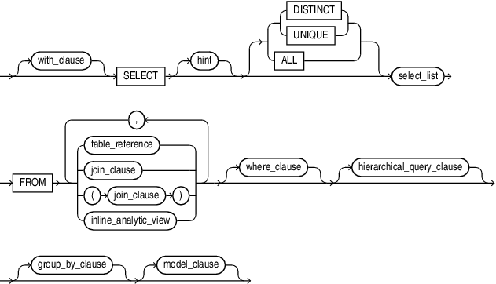

# Structure of a SELECT Statement {.unnumbered}

## Overview

](img/SQL_Execution_Guide.png){#fig-select-order}

:::{.callout-warning collapse="true"}
### Oracle SQL and the LIMIT clause

This diagram shows the use of the `LIMIT` clause. This keyword is standard in many SQL dialects, but is not used in Oracle SQL. To achieve the same thing, you would need to write something like:

```sql
SELECT ...
...
-- We have to use "FETCH" instead of "LIMIT" here
FETCH FIRST 5 ROWS ONLY
```

We've elected to include the diagram above because we think the main information it provides is so excellent. Just note that the final clause shown should be slightly different when you are working with Oracle SQL.
:::


Depending on how comfortable you are with SQL, the structure of a `SELECT` command can be hard to remember. However, you can get quite far when writing queries by knowing the order and significance of a few important clauses.

The overview shown by @fig-select-order is a great reference for the most important components of a `SELECT` statement. It shows you:

1. A succinct reference for the order of the most important keyword clauses
   - For example, your `FROM` keyword should come before a `GROUP BY` keyword
2. A visual reference that shows what each clause does to your table
3. An approximate reference for the order of operations that Oracle follows
   - For example, Oracle performs `WHERE` filtering *before* it does aggregations specified by your `GROUP BY` clause

## The Official, Comprehensive Structure



If you want to know the official, authoritative structure for a `SELECT` statement in Oracle SQL, you can find it [in Oracle's documentation](https://docs.oracle.com/en/database/oracle/oracle-database/19/sqlrf/About-Queries-and-Subqueries.html#GUID-0118DF1D-B9A9-41EB-8556-C6E7D6A5A84E).

This isn't a great place for learning how to do things, but it can be useful for understanding the "structure" inherent in SQL. Consult it if you're doing anything complex and you need to know whether something is possible at all.