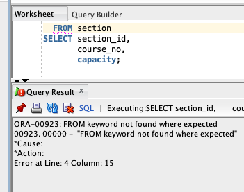
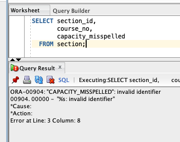

# Troubleshooting Oracle Errors

## Module Introduction

In this module, students will learn how to interpret and troubleshoot common Oracle SQL errors. Students will explore how Oracle reports errors, distinguish between syntax and execution problems, and review common error messages and their causes. This foundational knowledge is essential for diagnosing issues when querying data in a reporting context.

**Reference**: Oracle SQL by Example (4th Edition), Chapter 3 (Lab 3.2), Appendix G

## Explanation

### How Oracle Reports Errors

Oracle SQL error messages typically include:

* The line and column where the error was detected
* The Oracle error code (e.g., `ORA-00904`)
* A brief message describing the issue

Oracle parses SQL statements from the **bottom up**, meaning the actual issue may occur earlier than indicated. It's important to:

* Focus on fixing the first error reported
* Re-run the query after each fix to reveal additional issues

*Reference: Lab 3.2*

### Common Oracle SQL Errors

| Error Code | Description                              | Common Causes                      |
| - | - | - |
| ORA-00904  | Invalid identifier                       | Misspelled column or alias name    |
| ORA-00923  | FROM keyword not found where expected    | Missing comma or keyword in SELECT |
| ORA-00933  | SQL command not properly ended           | Improper syntax formatting         |
| ORA-00936  | Missing expression                       | Incomplete SELECT clause           |
| ORA-00942  | Table or view does not exist             | Incorrect table name or no access  |
| ORA-01017  | Invalid username/password                | Incorrect login credentials        |
| ORA-12154  | TNS could not resolve connect identifier | Misconfigured or missing TNS entry |

*Reference: Chapter 3, Lab 3.2; Appendix G*

### Syntax vs. Execution Errors

* **Syntax Errors**: The SQL statement is not a valid command. Example: `ORA-00933` (SQL command not properly ended)
  * Notice in the example below that SQL Developer has underlined with `FROM` keyword in red. This often means that something is wrong with the way we are specifying our query.



* **Execution Errors**: The SQL query is a valid command, but cannot be executed. Example: `ORA-00942` (table or view does not exist)



Understanding the type of error can help determine whether to revise SQL structure or verify the available schema objects.

*Reference: Lab 3.2*

### Using Oracle Documentation and Tools

Oracle provides tools and references for error resolution:

* Search Oracle documentation for the error code
* Use Oracle SQL Developer's hover and highlighting features to detect syntax issues

Appendix G explains common error prefixes:

* `ORA-` : Oracle database errors
* `TNS-` : Network-related errors
* `SP2-` : SQL\*Plus errors

*Reference: Appendix G*

### Debugging Strategies

#### Start Simple
- Begin with basic SELECT statements before adding complexity
- If something breaks, remove pieces until it works, then add back one at a time
- Save working queries before making changes

#### Read the Error Messages
- Don't ignore the red error text - it tells you exactly what's wrong
- Look for keywords like "invalid column" or "table not found"
- The error often points to the specific line with the problem

#### Check the Basics
- Verify table and column names are spelled correctly
- Make sure you're connected to the right database
- Confirm you have permission to access the tables you're querying

#### Common Mistakes
- Missing commas between column names in SELECT lists, or having an extra comma at the end
- Using single quotes for column names instead of double quotes
- Mixing up = (equals) and == (not used in SQL)

#### Still Stuck?
- Copy/paste the exact error message into a search engine
- Ask yourself: "What am I trying to accomplish?" and break it into smaller steps
- Use SQL Developer's autocomplete to help with syntax
- Don't be afraid to start over with a simpler approach

## Exercises

Use the STUDENT schema for the following exercises. Each of these queries is intentionally incorrect and will generate a specific Oracle error. Read the error message and revise the query to correct it.

1. Identify and fix the error in this query:

```sql
SELECT firstnme, last_name
FROM student;
```

2. Identify and fix the error in this query:

```sql
SELECT student_id last_name
FROM student;
```

3. Identify and fix the error in this query:

```sql
SELECT *
FROM studnt;
```

## Q&A

Food for thought:

* Which of the previous exercises were syntax errors?
* Which of the previous exercises were execution errors?

Open discussion of:

* Common error messages encountered by students
* Best practices for debugging SQL in Oracle Developer
* When to look up error codes in Oracle documentation
* How to interpret error line numbers and positioning

## Additional Resources

* *Oracle SQL by Example*, Lab 3.2 and Appendix G
* [Oracle Error Messages Manual](https://docs.oracle.com/en/database/oracle/oracle-database/19/errmg/index.html)
* SQL Developer error highlighting and documentation lookup features

## Answers

1. **Corrected query for misspelled column name**:

```sql
SELECT first_name, last_name
FROM student;
```

2. **Corrected query for missing comma**:

```sql
SELECT student_id, last_name
FROM student;
```

3. **Corrected query for nonexistent table name**:

```sql
SELECT *
FROM student;
```