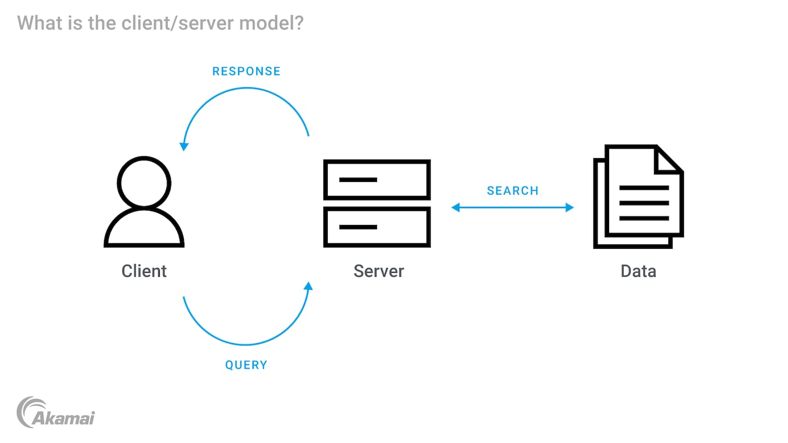
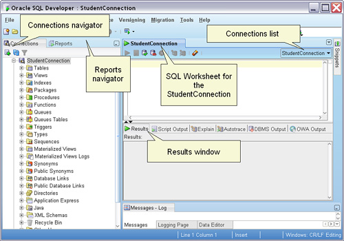
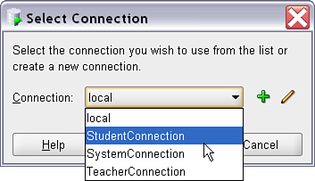
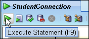
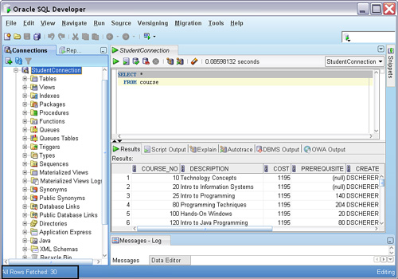
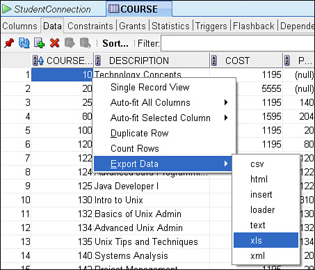
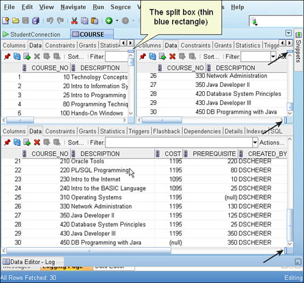

# SQL Developer Introduction

## Introduction

This module introduces Oracle SQL Developer, demonstrates how to work within the SQL Worksheet, and outlines techniques for exporting data in user-friendly formats such as Excel and CSV. It also touches on considerations when working with large datasets.

## SQL Developer Overview

### What is SQL Developer?

SQL Developer is a graphical interface for running SQL queries, managing database connections, and visualizing data outputs. It is a tool that allows users like you to interact with an Oracle database server.

In Oracle's client-server architecture, the database is divided into two parts: the **client** and the **server**.

- **Client**: This is where SQL Developer runs. It is the front-end application that users interact with to send requests to the database.
- **Server**: This is where the Oracle database resides. It processes the requests from the client, manages data, and sends the results back to the client.

SQL Developer (the client) allows you to send queries and commands to the Oracle database (the server), which processes these commands and returns the results to SQL Developer for you to see and use.

### Key Application Concepts

#### Navigation Panes

* **Connections Navigator**: Manage database connections.
* **Reports Navigator**: Access predefined data dictionary reports.
* **Connections**: View and manage database connections.
* **SQL Worksheet**: Write and execute SQL queries.
* **Results Panel**: View query results and messages.
* **Additional Tabs**: Include Script Output, Explain Plan, Autotrace, DBMS Output, etc.

#### SQL Worksheet

You can open a worksheet by:

  * Clicking the SQL Worksheet icon in the toolbar.
  * Right-clicking a connection name and choosing **Open SQL Worksheet**.
  * Using the **Tools > SQL Worksheet** menu option.

#### Connections

Each worksheet tab is tied to a specific database connection. You can:

  * Open multiple worksheets per connection.
  * Use the **Connections list** to switch execution contexts.

#### Executing SQL

  * Enter SQL in the worksheet and click the green triangle (or press F9) to execute.
  * The **Results tab** will display returned data with row numbers (for display only) and column headers.

#### Results Grid

The grid displays query results, which can be:

  * Copied to the clipboard.
  * Exported to various formats (Excel, CSV, etc.).
  * Filtered or sorted by clicking on column headers.

## Exporting to Excel and CSV Formats

SQL Developer supports data exports from both the **Data tab** and the **Results grid**.

### Steps to Export

1. Right-click on any data grid and choose **Export**.
2. Alternatively, use **Actions > Export** from the menu.
3. Choose a format:

   * **Excel (.xlsx)**
   * **CSV**
   * **HTML**
   * **SQL INSERT statements**
   * **SQL\*Loader (.ldr)**

### Large Dataset Considerations

Be cautious when exporting large datasets, as they can lead to performance issues or timeouts. Here are some strategies to manage large exports effectively:

* **Avoid SELECT \*** When dealing with large tables. Select only needed columns and/or rows.

* **Limit Rows**: Use the **Rows to Fetch** option in the export dialog to limit the number of rows returned.

* **Filtering**: Use WHERE or FETCH FIRST N ROWS ONLY statements or the Columns/Where export tabs to reduce volume.

#### Splitting the Display Vertically and Horizontally

When working with long or complex queries—or examining multiple result sets at once—it’s useful to split the SQL Developer interface to compare different parts of your script or results side by side.

#### Vertical and Horizontal Splits

You can split your SQL Worksheet or query result tabs either **horizontally** (top/bottom) or **vertically** (side-by-side). This is especially helpful when:

* Editing different parts of a large script
* Comparing two separate queries
* Viewing query results in one pane while editing SQL in another

